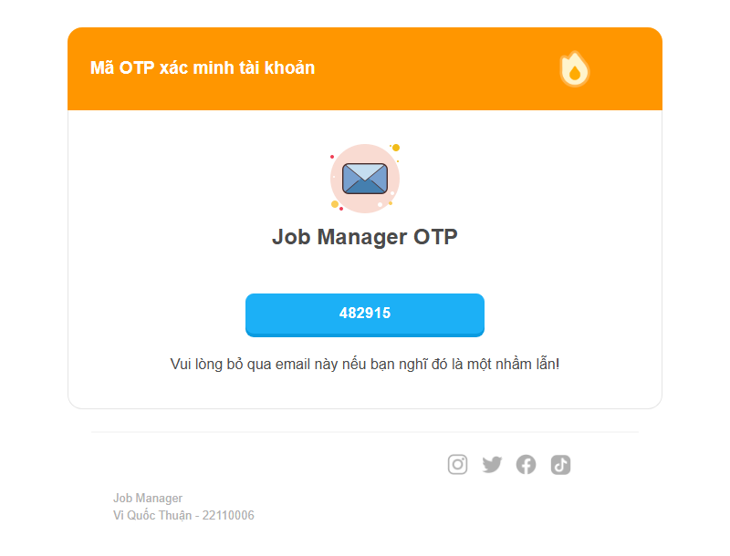

# Send Email Using MailKit Library in C# .NET

[](https://dotnet.microsoft.com/download/dotnet-framework/net472)
[](https://learn.microsoft.com/dotnet/csharp/)
[](https://www.nuget.org/packages/MailKit)
[](https://www.nuget.org/packages/MimeKit)
[](./LICENSE)
[](./.github/dependabot.yml)
[](https://github.com/TienNHM/MailKit-Template-Mail/commits/master)
[](https://github.com/TienNHM/MailKit-Template-Mail)
[](https://github.com/TienNHM/MailKit-Template-Mail/stargazers)

> MailKit is an Open Source cross-platform .NET library which is used for sending and receiving email messages. It is a complete re-write of the .NET Framework's System.Net.Mail library. MailKit supports SMTP, POP3, and IMAP protocols. It also supports S/MIME, OpenPGP, DKIM, and even more.

This project shows how to send an HTML email template (an OTP verification email) over SMTP using the MailKit library in C# .NET.

## Screenshot

<p align="center">
  
</p>

## Features

- Send HTML emails via SMTP, with both sync and async APIs ([MailHelper.cs](./MailHelper.cs))
- HTML email template with placeholders `@EmailTitle`, `@EmailContent`, `@OTP` ([SendOtpToEmail.html](./SendOtpToEmail.html))
- OTP generated with a cryptographically secure random number generator
- Template values are HTML-encoded before being inserted
- Always uses TLS (STARTTLS on port 587, implicit TLS on port 465) and validates the server certificate
- The SMTP password is read from an environment variable, never from source control

## Prerequisites

- .NET SDK 8.0 or later (the project targets .NET Framework 4.7.2), or Visual Studio 2019 or later
- An SMTP account, e.g. Gmail with an [App Password](https://myaccount.google.com/apppasswords)

## Getting Started

```powershell
git clone https://github.com/TienNHM/MailKit-Template-Mail.git
cd MailKit-Template-Mail
dotnet build
```

NuGet packages (MailKit, MimeKit, ...) are restored automatically on build.

## Configuration

Update `emailFrom`, `emailHost`, `emailPort` and `emailUsername` in [App.config](./App.config) before sending an email.

Please visit Google Account settings and create an App Password for the application by this [link](https://myaccount.google.com/apppasswords).

**Never commit the password.** Provide it through the `SMTP_PASSWORD` environment variable:

```powershell
$env:SMTP_PASSWORD = "your app password"
dotnet run -- recipient@example.com
```

You can pass several recipients:

```powershell
dotnet run -- alice@example.com bob@example.com
```

## Usage

```csharp
var input = new SendEmailBySMTPInput
{
    Title = "Test OTP",
    Content = htmlContent,
    Recipient = new List<string> { "recipient@example.com" },
};

var output = await MailHelper.SendEmailBySMTPAsync(input);
Console.WriteLine(output.IsSuccess ? "Send email success" : "Send email fail");
```

## Project Structure

```
├── MailHelper.cs            # SMTP sending logic (MailKit)
├── Program.cs               # Console entry point: builds the OTP email and sends it
├── SendEmailBySMTPInput.cs  # Input model (title, content, recipients)
├── SendEmailBySMTPOutput.cs # Output model (success flag, error message)
├── SendOtpToEmail.html      # HTML email template
├── App.config               # SMTP settings (no password)
└── docs/                    # README assets
```

## License

This project is licensed under the [MIT License](./LICENSE).

## Contributors


